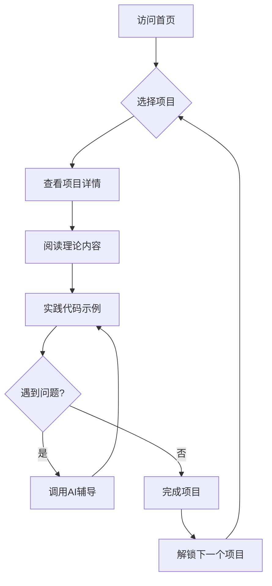
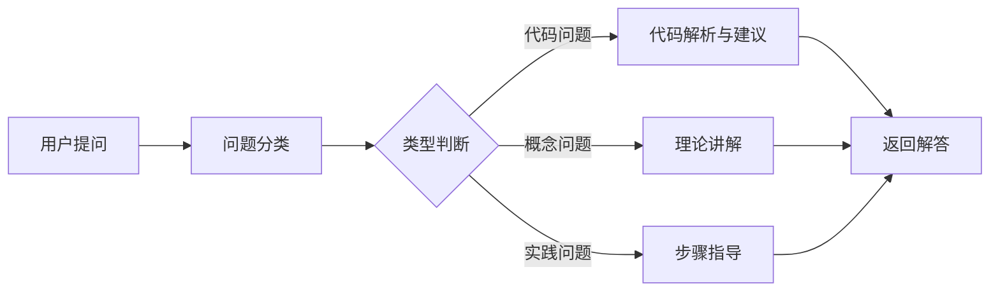

# Python数据分析AI训练平台 - 产品需求文档

## 1. 产品概述

**PyData AI Trainer** 是一款专为数据分析初学者设计的Python数据分析技术AI训练平台，旨在通过互动式学习路径和AI辅导，帮助大学生掌握从基础统计到机器学习的核心技能。

平台提供10个循序渐进的学习项目，每个项目都包含理论讲解、代码实践和AI智能辅导，让学习者能够在"做中学"的过程中高效提升数据分析能力。

## 2. 核心功能

### 2.1 用户角色

| 角色 | 注册方式 | 核心权限 |
|------|----------|----------|
| 学员 | 邮箱注册/游客浏览 | 浏览课程、参与训练项目、使用AI辅导 |

### 2.2 功能模块

1. **首页 (Home)**: 平台介绍、学习路径概览、热门项目展示、快速开始入口
2. **训练项目列表 (Projects)**: 10个数据分析训练项目展示，难度分类，标签筛选
3. **项目详情页 (Project Detail)**: 项目说明、学习目标、代码示例、AI辅导对话
4. **AI助手 (AI Tutor)**: 智能问答、代码解释、学习建议、错误诊断

### 2.3 页面详情

| 页面名称 | 模块名称 | 功能描述 |
|----------|----------|----------|
| 首页 | Hero区域 | 动态数据可视化背景，展示平台核心价值主张 |
| 首页 | 学习路径 | 可视化展示10个项目的学习路线图 |
| 首页 | 项目卡片网格 | 展示所有训练项目，支持悬停动画效果 |
| 项目列表 | 筛选器 | 按难度等级、技术标签筛选项目 |
| 项目列表 | 项目卡片 | 显示项目封面、标题、难度标签、预计时长 |
| 项目详情 | 项目信息 | 完整的项目描述、学习目标、前置技能 |
| 项目详情 | 代码编辑器 | 语法高亮、代码片段展示 |
| 项目详情 | AI辅导面板 | 实时问答、代码解析、学习建议 |

## 3. 核心流程

### 3.1 用户学习流程

### 3.2 AI辅导交互流程

## 4. 用户界面设计

### 4.1 设计风格

- **设计理念**: 数据实验室 (Data Lab) - 融合科技感与学术气质
- **主色调**: 深空灰 `#1a1a2e` 配合霓虹蓝 `#00d4ff`
- **辅助色**: 渐变紫 `#7b2cbf`、成功绿 `#00f5a0`、警告橙 `#ff9f1c`
- **字体**:
  - 标题: `JetBrains Mono` (等宽字体，强化技术感)
  - 正文: `Noto Sans SC` (中文优化，阅读舒适)
- **按钮风格**: 圆角矩形，悬停时发光效果，3D立体感
- **布局风格**: 卡片式布局，大量留白，网格系统
- **图标风格**: Lucide Icons，线性风格，Stroke Width: 1.5

### 4.2 页面设计总览

| 页面名称 | 模块名称 | UI元素与样式 |
|----------|----------|--------------|
| 首页 | Hero区域 | 全屏高度，动态网格背景，渐变文字，浮动数据元素动画 |
| 首页 | 学习路径 | 横向时间轴，节点发光效果，连接线流动动画 |
| 首页 | 项目卡片网格 | 3列网格，悬停时卡片上浮+阴影扩散，标签渐变边框 |
| 项目列表 | 筛选器 | 标签按钮组，选中态有填充色和发光效果 |
| 项目详情 | 信息区 | 大标题配副标题，进度指示器，标签流 |
| 项目详情 | 代码区 | 深色主题编辑器样式，行号显示，语法高亮 |
| AI辅导 | 对话区 | 气泡式对话，AI回复带打字机效果，用户消息右对齐 |

### 4.3 响应式策略

- **桌面优先** (1440px设计基准)
- **平板适配** (768px - 断点1列布局)
- **移动端优化** (375px - 触摸友好的按钮尺寸)

## 5. 10个训练项目设计

### 项目1: 探索性数据分析 (EDA) 入门
- **难度**: 入门
- **时长**: 2小时
- **技术栈**: Pandas, Matplotlib, Seaborn
- **学习目标**: 掌握数据加载、清洗、描述性统计、可视化基础

### 项目2: 电影评分数据分析
- **难度**: 入门
- **时长**: 2.5小时
- **技术栈**: Pandas, Matplotlib, NumPy
- **学习目标**: 数据聚合、分组统计、分布分析

### 项目3: 电商用户行为分析
- **难度**: 初级
- **时长**: 3小时
- **技术栈**: Pandas, Seaborn, Plotly
- **学习目标**: 用户路径分析、漏斗转化、留存分析

### 项目4: 股票数据可视化分析
- **难度**: 初级
- **时长**: 3小时
- **技术栈**: Pandas, Matplotlib, Yahoo Finance API
- **学习目标**: 时间序列处理、K线图、技术指标

### 项目5: 客户细分与聚类分析
- **难度**: 中级
- **时长**: 4小时
- **技术栈**: Scikit-learn, Pandas, Seaborn
- **学习目标**: K-Means聚类、特征工程、雷达图可视化

### 项目6: 房价预测模型
- **难度**: 中级
- **时长**: 4小时
- **技术栈**: Scikit-learn, Pandas, Matplotlib
- **学习目标**: 回归算法、特征重要性、模型评估

### 项目7: 文本情感分析
- **难度**: 中级
- **时长**: 4小时
- **技术栈**: NLTK, Scikit-learn, Pandas
- **学习目标**: 文本预处理、TF-IDF、分类器训练

### 项目8: 社交网络影响力分析
- **难度**: 高级
- **时长**: 5小时
- **技术栈**: NetworkX, Pandas, Matplotlib
- **学习目标**: 图论基础、中心性分析、社区检测

### 项目9: A/B测试效果分析
- **难度**: 高级
- **时长**: 4小时
- **技术栈**: SciPy, Pandas, Statsmodels
- **学习目标**: 假设检验、统计显著性、效果量计算

### 项目10: 实时数据仪表板
- **难度**: 高级
- **时长**: 5小时
- **技术栈**: Plotly Dash, Pandas, Redis
- **学习目标**: 交互式仪表板、实时数据流、可视化组件
