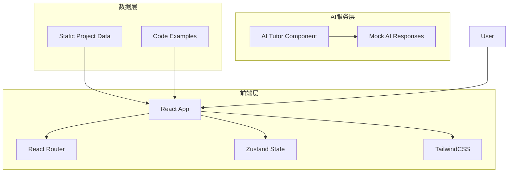

# Python数据分析AI训练平台 - 技术架构文档

## 1. 架构设计



## 2. 技术选型

| 类别 | 技术 | 版本 |
|------|------|------|
| 前端框架 | React | 18.x |
| 构建工具 | Vite | 5.x |
| 开发语言 | TypeScript | 5.x |
| 路由管理 | React Router DOM | 6.x |
| 状态管理 | Zustand | 4.x |
| 样式方案 | Tailwind CSS | 3.x |
| 图标库 | Lucide React | 最新 |
| 代码高亮 | Prism React Renderer | 最新 |

## 3. 路由定义

| 路由 | 用途 | 组件 |
|------|------|------|
| `/` | 首页 | `<Home />` |
| `/projects` | 项目列表 | `<Projects />` |
| `/projects/:id` | 项目详情 | `<ProjectDetail />` |
| `/ai-tutor` | AI导师页面 | `<AITutor />` |

## 4. 组件结构

```
src/
├── components/
│   ├── layout/
│   │   ├── Header.tsx
│   │   └── Footer.tsx
│   ├── home/
│   │   ├── Hero.tsx
│   │   ├── LearningPath.tsx
│   │   └── ProjectCard.tsx
│   ├── projects/
│   │   ├── ProjectFilter.tsx
│   │   └── ProjectGrid.tsx
│   ├── detail/
│   │   ├── ProjectInfo.tsx
│   │   ├── CodeBlock.tsx
│   │   └── AIChat.tsx
│   └── common/
│       ├── Button.tsx
│       ├── Tag.tsx
│       └── Badge.tsx
├── pages/
│   ├── Home.tsx
│   ├── Projects.tsx
│   ├── ProjectDetail.tsx
│   └── AITutor.tsx
├── data/
│   └── projects.ts
├── store/
│   └── useStore.ts
└── utils/
    └── aiTutor.ts
```

## 5. 数据模型

### 5.1 项目数据结构

```typescript
interface Project {
  id: string;
  title: string;
  titleEn: string;
  difficulty: '入门' | '初级' | '中级' | '高级';
  duration: string;
  description: string;
  objectives: string[];
  prerequisites: string[];
  techStack: string[];
  content: {
    theory: string;
    codeExample: CodeBlock;
  };
}
```

### 5.2 AI对话数据结构

```typescript
interface ChatMessage {
  id: string;
  role: 'user' | 'ai';
  content: string;
  timestamp: Date;
}
```

## 6. 状态管理

使用Zustand管理以下状态：

```typescript
interface AppState {
  // 当前选中的项目
  selectedProject: Project | null;
  // AI对话历史
  chatMessages: ChatMessage[];
  // 筛选状态
  filterDifficulty: string | null;
  filterTag: string | null;
  // Actions
  setSelectedProject: (project: Project) => void;
  addChatMessage: (message: ChatMessage) => void;
  setFilter: (difficulty: string | null, tag: string | null) => void;
}
```

## 7. AI导师模拟实现

由于是前端演示项目，AI导师使用预设的回复模式：

1. 根据用户问题关键词匹配预设回复
2. 支持代码解释、学习建议、概念讲解三种类型
3. 打字机效果模拟真实AI响应

## 8. 性能优化

- 路由懒加载 (React.lazy)
- 图片懒加载
- 代码分割
- Tailwind CSS JIT 模式
